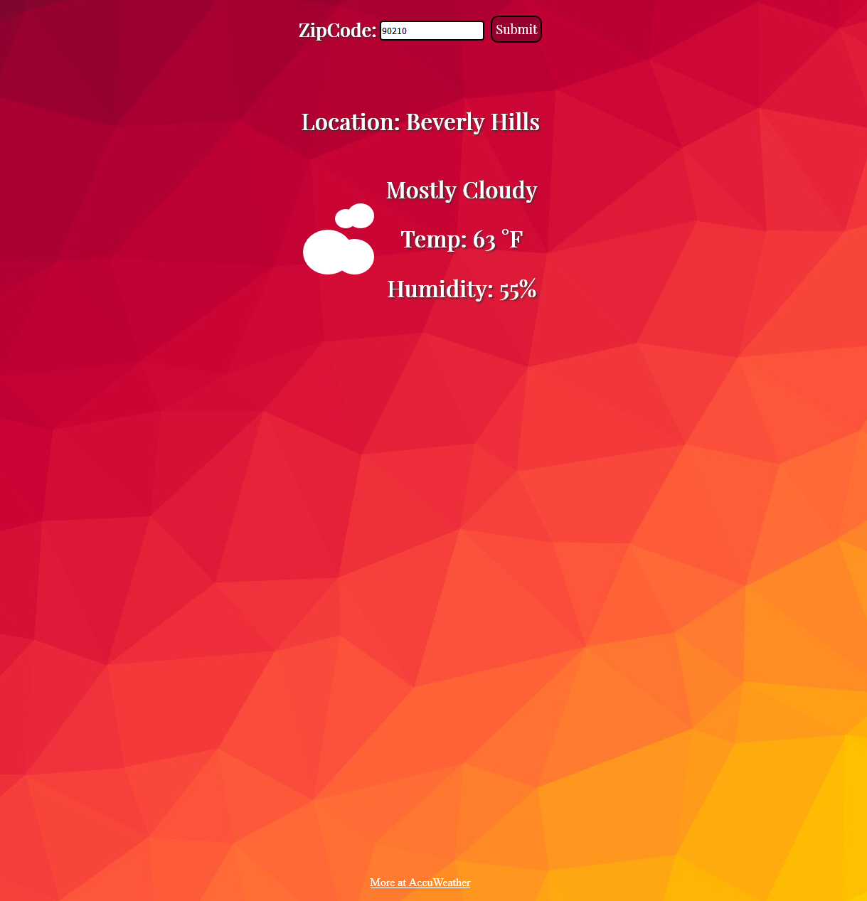

# Weather Website
> A small website that takes a user entered zipcode and retrieves the current weather using the AccuWeather API
>http://danielherrera.space/weather/

CSS icons were made by Tiffany Du and were retrieved from https://codepen.io/tiffanyadu/pen/OprNrV.
Text animations were made by Brielle and were retrieved from https://codepen.io/buntinb/pen/OEjENG.

Sample screenshot

# Testing

The site was tested on both mobile and desktop using both Chrome and Firefox. Zipcodes entered that aren't 5 digits long require the user to enter another zipcode. Zipcodes from outside of the US are also not considered valid. Zipcodes that contain letters or other characters are not valid. 

# Issues

The CSS icons don't seem to play well with the animations. When new icons are drawn there is a shift in the icons. For example, when the rain icon loads the rain lines will appear vertical at first and then shift to an angle when the animations are finished. 

# Possible Improvements

Possible improvements would include fixing the issue stated above, as well as adding an extended forecast.
